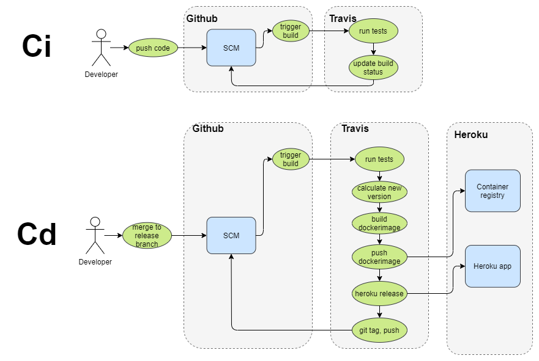

# JobPortalBE [](https://travis-ci.com/andraspatka/JobPortalBE)

Techstack: 
- BE: Java - Spring, Hibernate, maven, Postgresql
- FE: Angular
- Git: Github FE, Github BE
- Ci/CD: TravisCi

## Database

For instructions on quickly setting up a Postgres DB and PgAdmin in Docker, go to the "db" folder

## Java

Java version required: 11

Zulu JDK is recommended, get it 
[here](https://www.azul.com/downloads/zulu-community/?version=java-11-lts&os=windows&architecture=x86-64-bit&package=jdk).

## Maven

Newer version of Maven have support for a Maven wrapper.

To build the project, all you need to do is:

```
./mvnw package
```
You might get an error: "ERROR: JAVA_HOME is not set"
If you do, then set the JAVA_HOME environment variable to your JDK installation.
For Zulu it's: "C:\Program Files\Zulu\zulu-11"

## Lombok

In order to not get compilation errors in IntelliJ due to Lombok, it is recommended to install the Lombok plugin.

- ctrl + alt + s
- look for 'plugins'
- search for 'lombok'
- click on install

## OpenAPI

With the help of the openapi generator plugin, code can be generated from simple OpenAPI Specs (written in either json or yaml).
This makes development easier and faster, because the API specification is present in only one place, and code can be generated
for both the FE and BE from this specification.
 
On the Server side the generated code includes the DTO (Data Transfer Objects) and the Server Stubs for the API.

On the Client side, the generated Code includes the DTOs and the calls to the server.

References:
- [OpenApi Generator maven plugin](https://github.com/OpenAPITools/openapi-generator/tree/master/modules/openapi-generator-maven-plugin)
- [Documentation for writing OpenApi specs](https://swagger.io/specification/)

In order to generate code from the OpenAPI specs, run the following command:
```
mvn clean generate-sources
```

The sources are generated under **target/generated-sources/main/java/com/jobportal/openapi**

The OpenAPI Specs are written in JSON and can be found under: **src/main/resources/openapi**

For an example, please look at: 
- src/main/resources/openapi/example.json
- HelloController.java
- WorldController.java

## Ci/CD

Techstack:
- Ci: Travis
- Platform for deployments: Heroku

On each commit, the tests are ran and a dockerimage is created and pushed to the Github Container registry "jobportalbe".

Overview:



Versioning concept: major.minor.patch-branchName-m.numberOfCommits
example: 0.0.1-main-m.34
